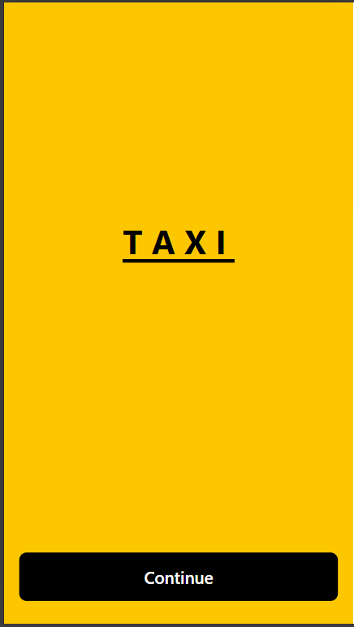
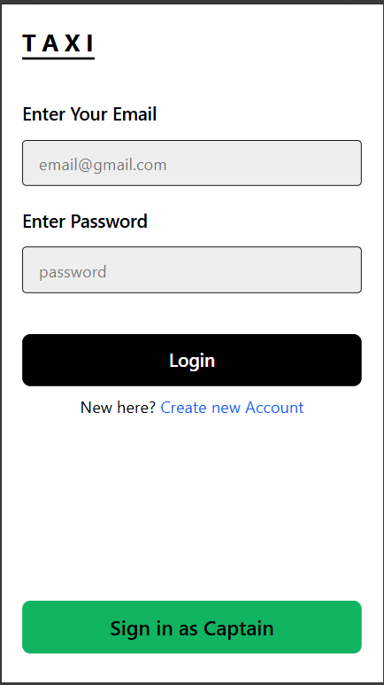
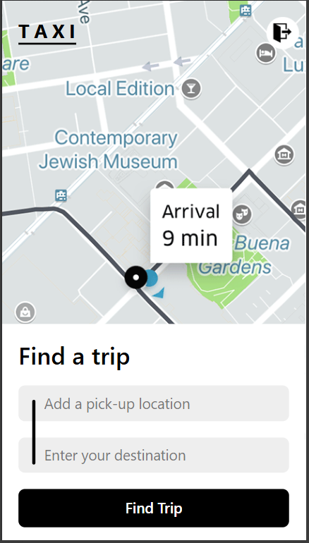
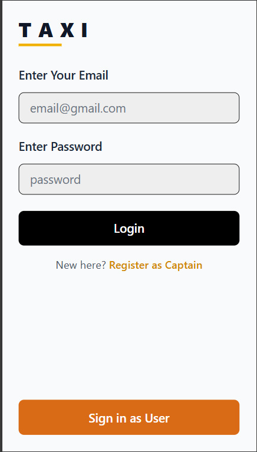
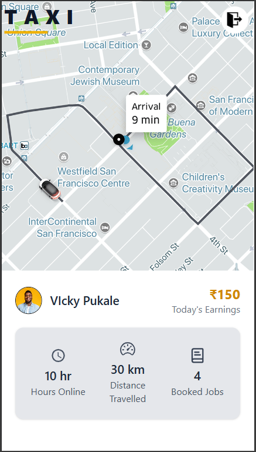
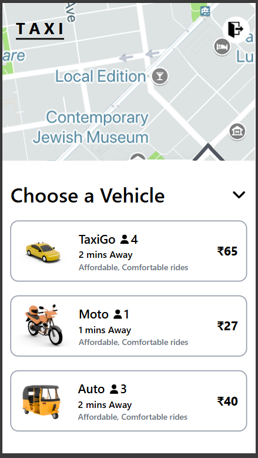
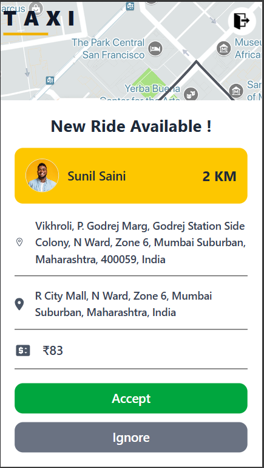

# 🚕 Taxi Booking App

A full-stack taxi booking web application inspired by Uber. This app allows users to search for pickup and destination locations, view fare estimates, select vehicle types, and book rides in real-time with driver status updates.

## 🔗 Live Demo

You can check out the live deployed version of the Taxi Booking App here:  
👉 [Taxi Booking App Live](https://taxi-booking-app-beta.vercel.app)

---

## 📸 Screenshots

  
  
  
  
  
    
  

---

## ✨ Features

### 👤 User Side
- Location auto-suggestion using OpenStreetMap (Nominatim)
- View estimated fare and travel time
- Choose vehicle type (Taxi, Auto, Bike)
- Realtime ride request and driver matching
- Ride status tracking (searching, waiting, riding)

### 🚖 Captain (Driver) Side
- Login to driver dashboard
- View ride requests
- Accept or reject bookings
- View ride earnings, travel stats

---

## 🛠️ Tech Stack

### Frontend
- **React.js**
- **Tailwind CSS**
- **React Router**
- **GSAP** (for animations)

### Backend
- **Node.js** & **Express.js**
- **MongoDB** with **Mongoose**
- **Socket.IO** for real-time communication
- **JWT** for authentication

---

## 🔐 Authentication
- JWT-based login and protected routes
- Role-based access (`user` / `captain`)

---

## 🌍 Location & Map Integration
- Leaflet is used for rendering dynamic maps.
- OpenStreetMap Nominatim for address suggestions
- OpenRouteService for distance and time calculation

---

